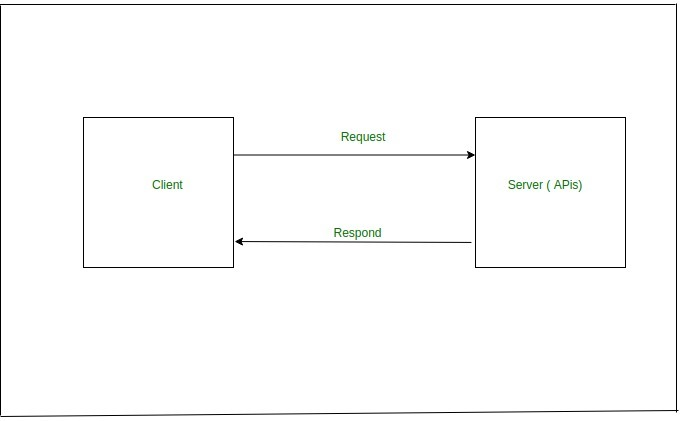
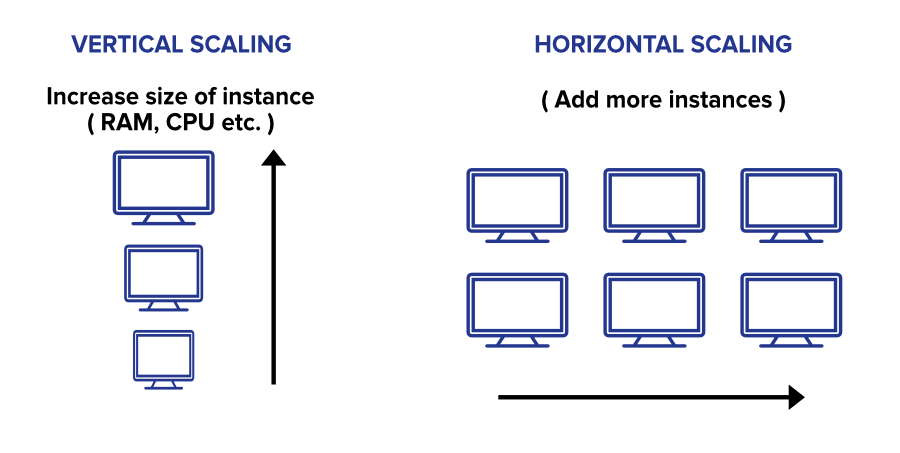
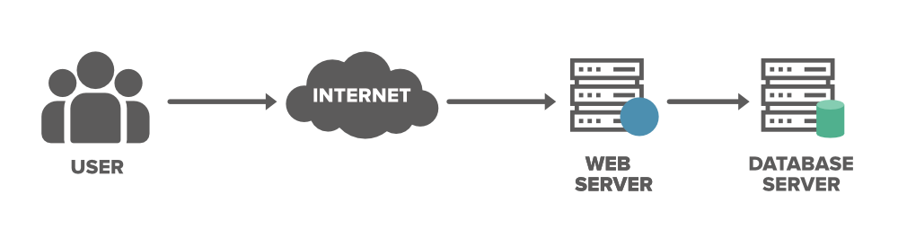
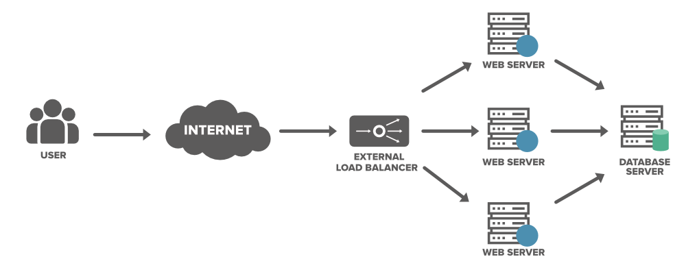

# Scalling

- [Scalling](#scalling)
  - [1. Vertical Scaling](#1-vertical-scaling)
    - [Advantages of Vertical Scaling](#advantages-of-vertical-scaling)
    - [Disadvantages of Vertical Scaling](#disadvantages-of-vertical-scaling)
    - [A Real-time Example of Vertical Scaling](#a-real-time-example-of-vertical-scaling)
  - [2. Horizontal Scaling](#2-horizontal-scaling)
    - [Advantages of Horizontal Scaling](#advantages-of-horizontal-scaling)
    - [Drawbacks](#drawbacks)
    - [A Real-time Example of Horizontal Scaling](#a-real-time-example-of-horizontal-scaling)
  - [Comparison](#comparison)
- [Load balancers](#load-balancers)
- [Refferences](#refferences)

The architecture shown below is an  example of a client-server based system. In this, there is a client who sends requests to the server and then the client receives a response from the server accordingly but when the number of users/clients increases, the load on the server increases enormously which makes it difficult for the server to perform efficiently and hence becomes slow. Therefore, it is important to make the server scalable in a way such that the server capacity increases according to the increasing traffic without any sort of failure.

**Scaling** is the process of expanding resources and performance with increasing load and traffic on an existing system without increasing complexity. Horizontal and vertical scaling are two types of scaling methods.

Option for scaling your database can be grouped into two major categories… 
* Vertical Scaling
* Horizontal Scaling
  

## 1. Vertical Scaling
In simple terms upgrading the capacity of a single machine or moving to a new machine with more power is called vertical scaling. You can add more powers to your machine by adding better processors, increasing RAM, or other power increasing adjustments. Vertical scaling can be easily achieved by switching from small to bigger machines but remember that this involves downtime. You can enhance the capability of your server without manipulating your code. 
Example: **MySQL**

* This approach is also referred to as the ‘scale-up‘ approach.
* It doesn’t require any partitioning of data and all the traffic resides on a single node with more capacity.
* Easy implementation.
* Less administrative efforts as you need to manage just one system.
* Application compatibility is maintained.
* Mostly used in small and mid-sized companies.
* MySQL and Amazon RDS is a good example of vertical scaling.
  
### Advantages of Vertical Scaling
* It is easy to implement
* Reduced software costs as no new resources are added
* Fewer efforts required to maintain this single system
* Disadvantages of Vertical Scaling
* Single-point failure
* Since when the system (server) fails, the downtime is high because we only have a * single server
* High risk of hardware failures
### Disadvantages of Vertical Scaling
* Single-point failure
* Since when the system (server) fails, the downtime is high because we only have a single server
* High risk of hardware failures
### A Real-time Example of Vertical Scaling
When traffic increases, the server degrades in performance. The first possible solution that everyone has is to increase the power of their system. For instance, if earlier they used 8 GB RAM and 128 GB hard drive now with increasing traffic, the power of the system is affected. So a possible solution is to increase the existing RAM or hard drive storage, for e.g. the resources could be increased to 16 GB of RAM and 500 GB of a hard drive but this is not an ultimate solution as after a point of time, these capacities will reach a saturation point. 

 
  
## 2. Horizontal Scaling
This approach is the best solution for projects which have requirements for high availability or failover. In horizontal scaling, we enhance the performance of the server by adding more machines to the network, sharing the processing and memory workload across multiple devices. We simply add more instances of the server to the existing pool of servers and distribute the load among these servers. In this approach, there is no need to change the capacity of the server or replace the server. Also, like vertical scaling, there is no downtime while adding more servers to the network. Most organizations choose this approach because it includes increasing I/O concurrency, reducing the load on existing nodes, and increasing disk capacity. 

* This approach is also referred to as the ‘scale-out’ approach.
* Horizontal scalability can be achieved with the help of a distributed file system, clustering, and load–balancing.
* Traffic can be managed effectively.
* Easier to run fault-tolerance.
* Easy to upgrade
* Instant and continuous availability.
* Easy to size and resize properly to your needs.
* Implementation cost is less expensive compared to scaling-up
* Google with its Gmail and YouTube, Yahoo, Facebook, eBay, Amazon, etc. are heavily utilizing horizontal scaling.
* Cassandra and MongoDB is a good example of horizontal scaling.
  
### Advantages of Horizontal Scaling
* **Fault Tolerance** means that there is no single point of failure in this kind of scale because there are 5 servers here instead of 1 powerful server. So if anyone of the servers fails then there will be other servers for backup. Whereas, in Vertical Scaling there is single point failure i.e: if a server fails then the whole service is stopped.
* Low Latency: Latency refers to how late or delayed our request is being processed.
* Built-in backup
### Drawbacks
* Complicated architectural design
* High licensing fees
* High utility costs such (cooling and electricity)
* The requirement of extra networking equipment such as routers and switches.
  
### A Real-time Example of Horizontal Scaling
For example, if there exists a system of the capacity of 8 GB of RAM and in future, there is a requirement of 16 GB of RAM then, rather than the increasing capacity of 8 GB RAM to 16 GB of RAM, similar instances of 8 GB RAM could be used to meet the requirements. 

## Comparison
	
| Horizontal Scaling      | Vertical Scaling  |
| ----------- | ----------- |
| Load balancing required      | Load balancing not required       |
| Resilient to system failure  | Single point of failure        |
|Utilizes Network Calls|Interprocess communication|
|Data inconsistency|Data consistent|
|Scales well|Hardware limit|

# Load balancers
A load balancer is a device that acts as a reverse proxy and distributes network or application traffic across a number of servers. Load balancers are used to increase capacity (concurrent users) and reliability of applications. They improve the overall performance of applications by decreasing the burden on servers associated with managing and maintaining application and network sessions, as well as by performing application-specific tasks.

Consider a scenario where an application is running on a single server and the client connects to that server directly without load balancing. It will look something like below

We need to discuss the two main problems with this model…

* Single Point of Failure: If the server goes down or something happens to the server the whole application will be interrupted and it will become unavailable for the users for a certain period. It will create a bad experience for users which is unacceptable for service providers.
* Overloaded Servers: There will be a limitation for the number of requests which a web server can handle. If the business grows and the number of requests increases the server will be overloaded. To solve the increasing number of requests we need to add a few more servers and we need to distribute the requests 
to the cluster of servers. 

To solve the above issue and to distribute the number of requests we can add a load balancer in front of the web servers and allow our services to handle any number of requests by adding any number of web servers in the network. We can spread the request across multiple servers. For some reason, if one of the servers goes offline the service will be continued. Also, the latency on each request will go down because each server is not bottle-necked on RAM/Disk/CPU anymore.

 

# Refferences
* https://www.f5.com/services/resources/glossary/load-balancer#:~:text=A%20load%20balancer%20is%20a,users%20and%20reliability%20of%20applications.
*  https://www.geeksforgeeks.org/system-design-horizontal-and-vertical-scaling/
*  https://github.com/mgp/book-notes/blob/master/high-scalability-notes.markdown
*  https://gist.github.com/vasanthk/485d1c25737e8e72759f
*  https://www.geeksforgeeks.org/load-balancer-system-design-interview-question/
